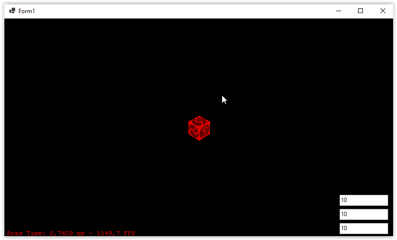

# vb-net-gltf-render

<p align="center">
  
</p>

## Overview

`vb-net-gltf-render` is a simple GLTF model renderer built using VB.NET, .NET 6.0, SharpGL, and SharpGLTF libraries. The project demonstrates loading, displaying, and interacting with GLTF models within a Windows Forms application.

## Features

- Asynchronously loads GLTF models.
- Supports texture loading and mapping.
- Anti-aliasing support.
- Displays materials used in the GLTF model.

## Requirements

- .NET 6.0
- SharpGL
- SharpGLTF

## Installation

1. Clone the repository:
   ```bash
   git clone https://github.com/ran-j/vb-net-gltf-render.git
   ```
2. Open the solution in Visual Studio.
3. Restore the NuGet packages.
4. Build the solution.

## Usage

1. Open the `Form1.vb` file to see the main logic for loading and rendering the GLTF model.
2. The model is loaded asynchronously when the form is loaded:
   ```vb
   Private Async Sub Form1_Load(sender As Object, e As EventArgs) Handles MyBase.Load
       Await LoadGLTFModelAsync("BoxTextured.glb")
       ListMaterials()
   End Sub
   ```